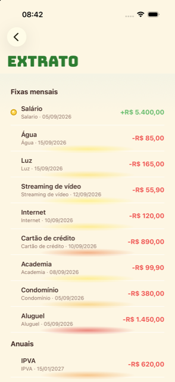

# AppBroto

Controle financeiro pessoal e simulador de decisões futuras — um app React Native/Expo focado em responder, com números reais e data exata (não só "no papel"), a pergunta que mais importa: **"se eu continuar no ritmo atual, meu saldo vai ficar negativo em algum momento?"**

Projeto pessoal, construído e refinado com dados reais de uso próprio: cada correção de lógica no motor de projeção nasceu de um caso real que os números não estavam capturando direito.

<p align="center">
  
  
  
  
  
</p>

*(dados fictícios de demonstração — o app nunca envia nada pra nenhum servidor)*

## Sobre o projeto

A maioria dos apps de finanças pessoais soma receita e despesa por mês e para por aí. O problema é que isso esconde risco real: um salário que cai no dia 30 pode, na prática, ser o dinheiro que paga as contas do mês *seguinte* — e uma despesa que vence no dia 10 pode deixar o saldo negativo por semanas mesmo que o mês, no fechamento, termine positivo.

O AppBroto projeta o saldo **dia a dia**, não mês a mês, caminhando por cada lançamento (real ou recorrente) na sua data exata, achando o primeiro dia em que o saldo cruzaria para o vermelho e avisando se a situação piora ainda mais depois disso. Todo o dado fica **só no aparelho** (SQLite local), sem backend, sem nuvem, sem conta — é um app de finanças que não sabe nada sobre suas finanças além do que você mesmo lança nele.

## Principais funcionalidades

- **Lançamentos**: receitas e despesas únicas, mensais (fixas) ou anuais (ex: IPVA, 13º), organizadas por categoria.
- **Dashboard "Situação atual"**: projeta 365 dias à frente e avisa a data exata em que o saldo ficaria negativo (não só "no fim do mês"), com o valor que faltaria para não ficar.
- **"Rever gastos"**: aponta a maior despesa do mês e sugere quanto cortar (valor e %) mirando numa folga de segurança real, não só em zerar o problema.
- **Simulador de decisões**: simula uma compra parcelada ou uma meta de economia, mostra se cabe no orçamento, compara cenários lado a lado e projeta um "e se eu cortasse X% do meu gasto do dia a dia".
- **Backup/restauração**: exporta e importa todos os dados em arquivo, sem depender de servidor algum.
- **Bloqueio do app**: Face ID / Touch ID / PIN do sistema antes de abrir.
- **Conquistas e tutorial**: sistema de gamificação leve, derivado dos próprios lançamentos (sem histórico extra guardado), com tutorial de primeiros passos.
- **Acessibilidade**: labels, roles e estados de acessibilidade no app inteiro, com suporte a "reduzir movimento".

## Destaques técnicos

- **Motor de projeção dia a dia** (`src/logic/projecao.ts`): em vez de agregar por mês, enumera cada ocorrência real de cada lançamento/simulação na data exata (incluindo parcelas, recorrências mensais/anuais com corte em fim de mês, ex: 31 → 28/29 em fevereiro) e caminha um saldo acumulado, achando o ponto mínimo real da trajetória.
- **344 testes automatizados** (Jest) cobrindo desde o motor de projeção até casos de borda de fuso horário e ponto flutuante; grande parte nasceu de bugs reais encontrados testando com dados de uso próprio, cada um com um teste de regressão dedicado.
- **Gráfico com ApexCharts embutido numa WebView**, com fallback automático para um gráfico nativo quando o módulo não está disponível no build.
- **100% local-first**: Drizzle ORM sobre SQLite (`expo-sqlite`); nenhum dado sai do aparelho.

## Stack

- **React Native** + **Expo** (SDK 57) — dev client (não roda no Expo Go: usa módulos nativos como SQLite, autenticação biométrica e WebView)
- **TypeScript**
- **Drizzle ORM** sobre `expo-sqlite`
- **Zustand** para estado global
- **React Navigation** (native-stack)
- **ApexCharts** (WebView) com fallback nativo (`react-native-gifted-charts`)
- **Jest** + `jest-expo` para testes
- **ESLint** (`eslint-config-expo`)

## Organização do código

```
src/
├── charts/       # opções e HTML do gráfico ApexCharts (WebView)
├── components/   # componentes de UI reutilizáveis
├── data/         # dados estáticos (sugestões de categoria etc.)
├── db/           # schema e acesso ao SQLite (Drizzle)
├── hooks/        # hooks customizados
├── logic/        # regras de negócio puras (projeção, simulações, orçamento) — o coração do app, com a maior cobertura de teste
├── navigation/    # configuração de rotas (React Navigation)
├── screens/      # telas
├── store/        # estado global (Zustand)
├── theme/        # cores, tipografia
├── types/        # tipos compartilhados
└── utils/        # utilitários (datas, formatação, etc.)
```

A lógica de negócio (`src/logic`) é isolada das telas de propósito — é testada em isolamento, sem precisar renderizar UI.

## Como rodar localmente

```bash
npm install
npx expo start --dev-client
```

Em outro terminal, com o Metro já rodando:

```bash
npx expo run:ios       # simulador iOS
npx expo run:android   # emulador/aparelho Android
```

> Precisa de um **dev client** (build nativo), não funciona no Expo Go — o app usa módulos nativos (SQLite, autenticação biométrica, WebView) que o Expo Go não inclui.

## Testes

```bash
npm test
```

345 testes, cobrindo principalmente a camada de lógica de negócio (`src/logic`).

## Lint

```bash
npm run lint
```

ESLint (`eslint-config-expo`), incluindo as regras experimentais do plugin `react-hooks` — duas ou três delas ficam explicitamente desligadas em `eslint.config.js`, com o porquê documentado ali (padrões intencionais do projeto que colidem com regras ainda em formação para o React Compiler).

## Licença

Todos os direitos reservados. Este repositório é público para fins de portfólio e avaliação técnica; uso, cópia ou redistribuição do código sem autorização do autor não são permitidos.

## Autor

Guilherme Rocha Cocchevia — [GitHub](https://github.com/GuilhermeCocchevia)
